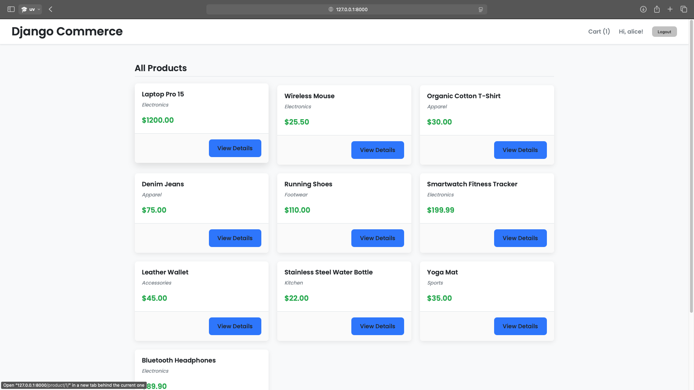
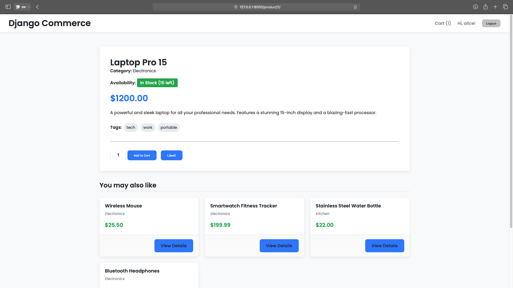
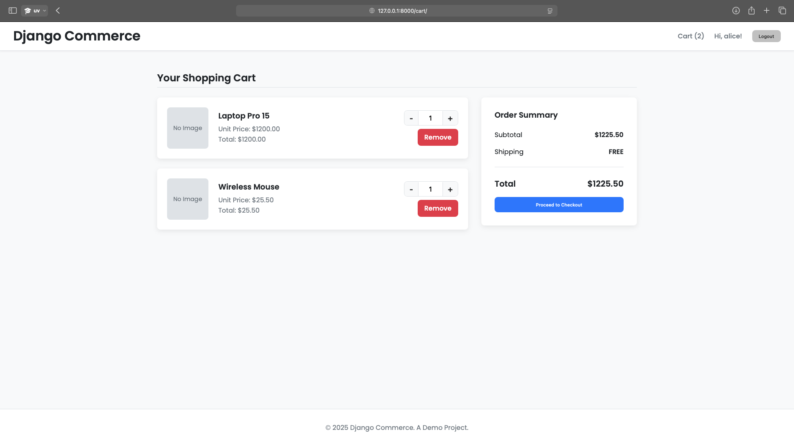
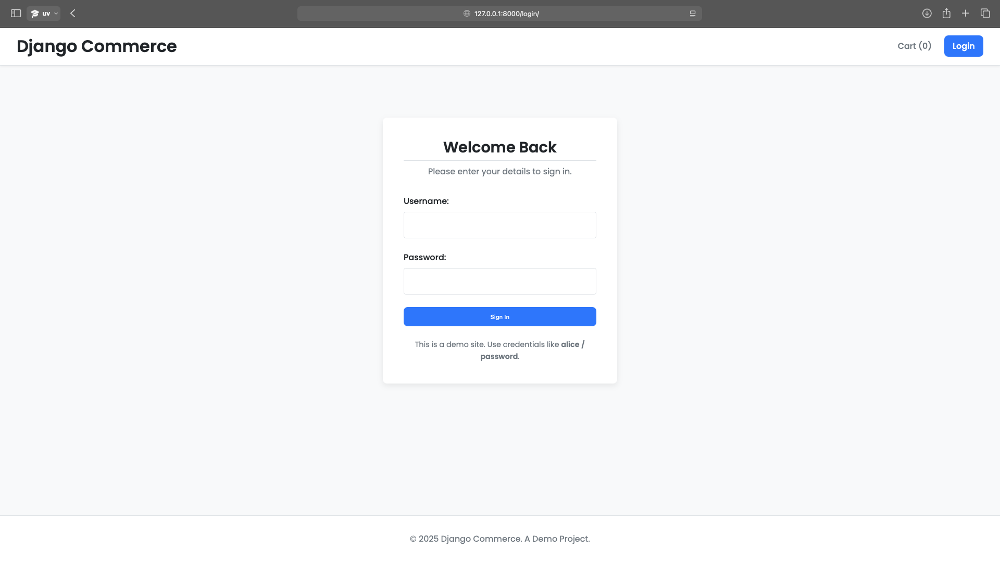
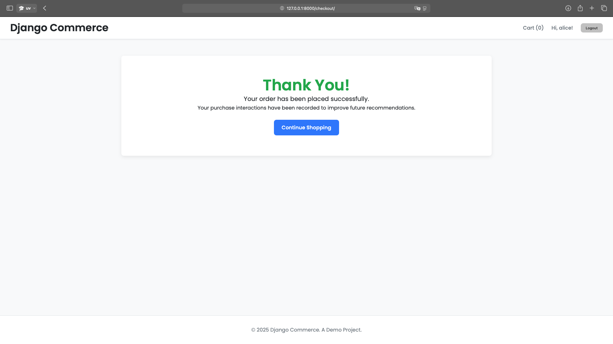

# Django E-commerce Platform with AI-Powered Recommendations

<p align="center">
  
</p>

<div align="center">

[](https://www.python.org/)
[](https://www.djangoproject.com/)
[](https://cython.org/)
[](https://opensource.org/licenses/MIT)
[](https://github.com/psf/black)
[](https://github.com/your-username/ecommerce-project/actions)
[](https://github.com/your-username/ecommerce-project)

</div>

---

A complete **Django e-commerce application** featuring an AI-powered recommendation system with **Cython-optimized performance**. This project demonstrates full-stack expertise, with a robust backend, responsive UI, and an intelligent recommendation engine that adapts to user behavior.

## ✨ Core Features

### 🛒 E-commerce Functionality
- **Product Catalog:** Modern listing and detail pages.
- **Dynamic Shopping Cart:** Real-time AJAX updates, add/remove items.
- **User Authentication:** Login, logout, and secure session management.
- **Mock Checkout:** Records purchases to improve recommendations.
- **Image Handling:** Products include image uploads managed via Django Admin.

### 🤖 AI-Powered Recommendation System
- **Content-Based Filtering:** Products represented as vectors from attributes (tags).
- **"You May Also Like":** Cosine Similarity suggests similar products on detail pages.
- **"Recommended for You":** Personalized recommendations for logged-in users based on interaction history.
- **Real-time Feedback:** Likes and purchases instantly update user preference profiles.

### 🚀 Cython Performance Optimization
- **Optimized Cosine Similarity:** Heavy computation re-implemented in Cython for high performance.
- **Fallback Mechanism:** Pure Python implementation ensures compatibility if Cython module is missing.
- **Scalable & Efficient:** Faster recommendations on large datasets.

## 🛠️ Technology Stack

- **Backend:** Django 5, Python 3.10+
- **Database:** SQLite (development)
- **AI / Data Science:**
  - **NumPy & Pandas:** Efficient matrix and data handling.
  - **Content-Based Filtering:** Product recommendation algorithm.
- **Performance:** Cython 3.0 for optimized similarity calculations.
- **Frontend:**
  - HTML5, CSS3, responsive design (Flexbox & Grid).
  - Vanilla JavaScript for dynamic AJAX interactions.

## 🚀 Getting Started

### 1. Prerequisites
- Python 3.10+
- `pip` and `venv`

### 2. Clone the Repository
```bash
git clone https://github.com/your-username/ecommerce-project.git
cd ecommerce-project
```

### 3. Set Up a Virtual Environment

```bash
# Create and activate the virtual environment
python3 -m venv venv
source venv/bin/activate

# On Windows, use:
# venv\Scripts\activate
```

### 4. Install Dependencies

Install all required packages from `requirements.txt`.

```bash
pip install -r requirements.txt
```

### 5. Compile the Cython Module (Recommended for Performance)

To enable the high-performance recommendation engine, build the Cython extension.

```bash
python setup.py build_ext --inplace
```
*If you skip this step, the application will automatically use the slower Python fallback.*

### 6. Set Up the Database

Run the standard Django migrations to create the database schema.

```bash
python manage.py migrate
```

### 7. Create a Superuser

This account is needed to access the Django Admin to manage products and images.

```bash
python manage.py createsuperuser
```
Follow the prompts to set a username and password.

### 8. Load the Demo Data

A management command is provided to populate the database with sample products, users, and interaction data.

```bash
python manage.py load_demo_data
```

**Demo User Credentials:**
The loader creates several users. You can log in with:
- **Username:** `alice`
- **Password:** `password`

### 9. Run the Development Server

You are now ready to launch the application!

```bash
python manage.py runserver
```
The e-commerce site will be available at `http://127.0.0.1:8000/`.
The Django Admin panel will be at `http://127.0.0.1:8000/admin/`.

## 🖼️ Project Showcase

| Product Detail Page | Dynamic Shopping Cart |
| :---: | :---: |
|  |  |
| **Modern Login Page** | **Checkout Confirmation** |
|  |  |

## 📜 License

This project is licensed under the [MIT License](LICENSE) - feel free to use, modify, and distribute it.

